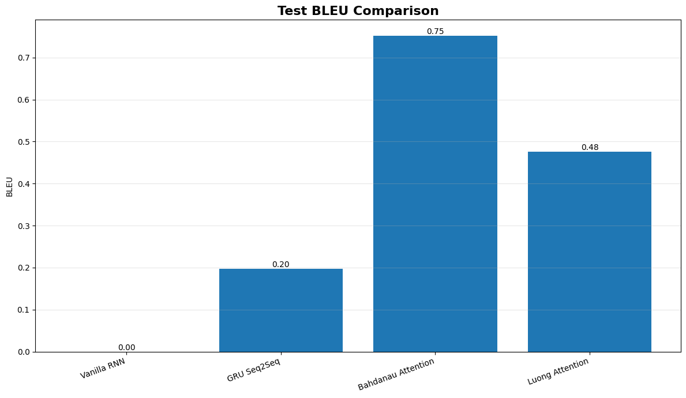
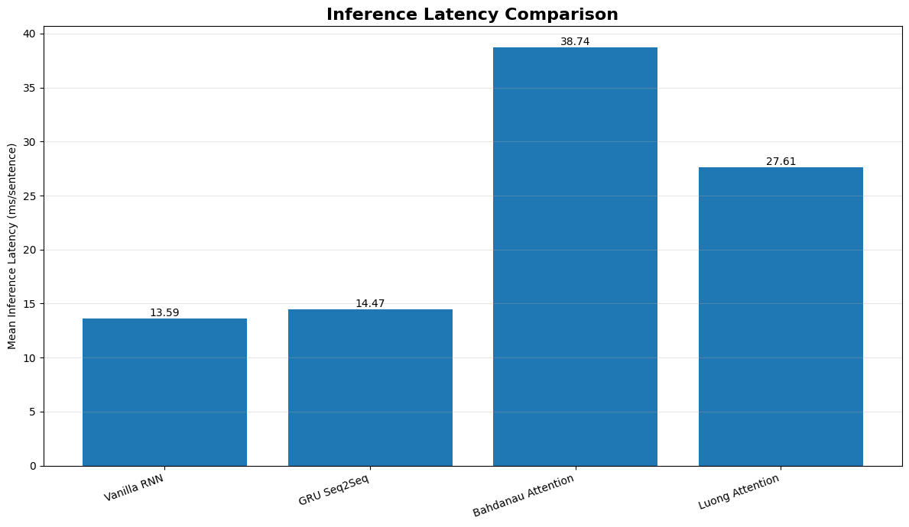
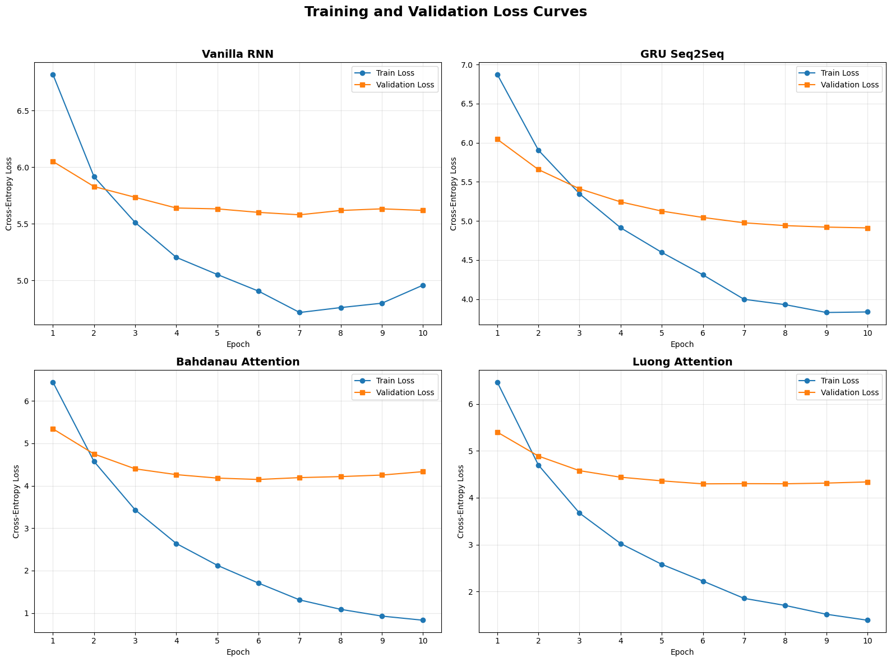
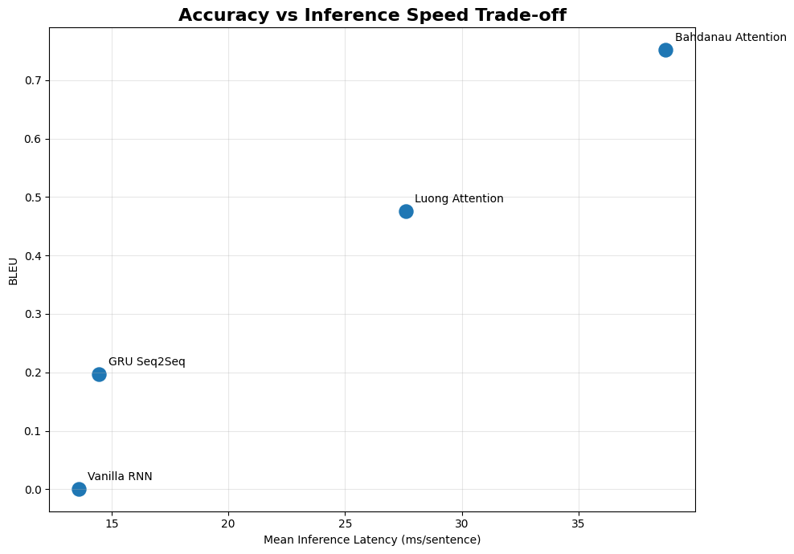

# Comparative Analysis of Machine Translation Models

**A controlled experimental comparison of four sequence-to-sequence architectures for English → Korean neural machine translation.**

---

## Table of Contents

1. [Overview](#overview)
2. [Problem Statement](#problem-statement)
3. [Dataset](#dataset)
4. [Models Compared](#models-compared)
5. [Experimental Setup](#experimental-setup)
6. [Results](#results)
7. [Training Behaviour](#training-behaviour)
8. [Accuracy vs. Speed Trade-off](#accuracy-vs-speed-trade-off)
9. [Qualitative Examples](#qualitative-examples)
10. [Discussion](#discussion)
11. [Limitations](#limitations)
12. [How to Run](#how-to-run)
13. [Repository Structure](#repository-structure)
14. [References](#references)

---

## Overview

This project trains and evaluates **four neural machine translation (NMT) architectures from scratch** on the same English–Korean parallel corpus, under identical data splits, hyperparameters, and hardware, in order to isolate the effect of **architecture and attention mechanism** on translation quality, convergence, and inference speed.

The four models span the historical progression of encoder-decoder NMT design:

| # | Model | Core Idea |
|---|-------|-----------|
| 1 | Vanilla RNN Seq2Seq | Plain RNN encoder-decoder, no attention |
| 2 | GRU Seq2Seq | Gated recurrence, no attention |
| 3 | Bahdanau (Additive) Attention | GRU decoder + additive attention over encoder states |
| 4 | Luong (Multiplicative) Attention | GRU decoder + dot-product-style attention over encoder states |

All models are trained end-to-end in PyTorch and evaluated using **BLEU**, **perplexity**, and **inference latency**.

---

## Problem Statement

Encoder-decoder models without attention must compress an entire source sentence into a single fixed-length vector, which becomes a bottleneck for longer sentences. Attention mechanisms were introduced to let the decoder look back at all encoder hidden states at every decoding step. This project empirically tests that claim by asking:

> **Does adding attention (and which flavour of attention) measurably improve translation quality, and at what computational cost?**

---

## Dataset

| Property | Value |
|---|---|
| Language pair | English → Korean |
| Source | [ManyThings.org / Tatoeba](https://www.manythings.org/anki/kor-eng.zip) (`kor-eng.zip`) |
| Raw usable sentence pairs | 6,394 |
| After sequence-length filtering (≤ 30 tokens) | 6,392 |
| Train / Validation / Test split | 80% / 10% / 10% → **5,113 / 639 / 640** |
| Source vocabulary size | 2,044 tokens |
| Target vocabulary size | 2,363 tokens |
| Tokenizer | Whitespace tokenizer (deterministic, no external dependency) |
| Random seed | 10 (data split seed: 4) |

**Preprocessing pipeline:** lowercasing → Unicode punctuation normalization → whitespace collapsing → tokenization → length filtering → deterministic train/val/test split → vocabulary building with `<pad>`, `<sos>`, `<eos>`, `<unk>` special tokens.

---

## Models Compared

**Shared configuration across all four models** (to keep the comparison fair):

| Hyperparameter | Value |
|---|---|
| Embedding dimension | 256 |
| Hidden dimension | 256 |
| Max sequence length | 30 |
| Batch size | 64 |
| Optimizer | Adam |
| Learning rate | 0.001 |
| Loss function | Cross-Entropy (padding ignored) |
| Gradient clipping | 1.0 |
| Epochs | 10 |
| Teacher forcing ratio | Linearly annealed 1.0 → 0.5 over training |

### Architecture notes

- **Vanilla RNN Seq2Seq** — A plain `nn.RNN` encoder feeds its final hidden state into a plain RNN decoder. No attention; the entire source sentence must be compressed into one hidden vector.
- **GRU Seq2Seq** — Same structure as above, but the recurrent unit is replaced with a GRU to mitigate vanishing gradients and improve long-range memory.
- **Bahdanau Attention** — Implements additive attention: `e_ti = vᵀ·tanh(W_h·h_i + W_s·s_t)`, followed by softmax normalization and a context vector computed as a weighted sum of encoder states.
- **Luong Attention** — Implements general multiplicative attention: `score(s_t, h_i) = s_tᵀ·W_a·h_i`, followed by the same softmax + weighted-sum context computation.

---

## Experimental Setup

- All four models are trained **independently**, with the random seed reset before each run for fair initialization.
- Evaluation metrics: **Corpus BLEU-4** (with NLTK smoothing), **sentence-level BLEU**, **test-set perplexity** (`exp(cross-entropy loss)`, clipped for numerical stability), and **inference latency** (mean / median / P95, measured in ms per sentence with GPU/CPU synchronization and a warm-up phase).
- Decoding strategy: **greedy decoding** at inference time.
- Hardware used for this run: **CPU**.

---

## Results

### Quantitative Summary

| Model | Parameters | BLEU-4 | Sentence BLEU | Perplexity | Mean Latency (ms) | P95 Latency (ms) | Training Time (min) |
|---|---:|---:|---:|---:|---:|---:|---:|
| Vanilla RNN | 1,998,651 | ~0.00 | 0.276 | 213.49 | 13.59 | 16.35 | 11.99 |
| GRU Seq2Seq | 2,524,987 | 0.196 | 0.595 | 100.30 | 14.47 | 16.61 | 9.66 |
| **Bahdanau Attention** | 4,062,779 | **0.752** | **1.163** | **49.60** | 38.74 | 45.89 | 21.94 |
| Luong Attention | 3,996,987 | 0.476 | 0.902 | 59.11 | 27.61 | 31.02 | 20.63 |

*(BLEU is reported on a 0–1 scale, consistent with the notebook's raw NLTK output; multiply by 100 for the conventional 0–100 BLEU scale.)*

**Headline result: Bahdanau Attention was the strongest model on every accuracy metric** — highest BLEU, lowest perplexity — but it is also the slowest and largest model (2× the parameters of the plain GRU model, ~2.7× its inference latency).

### BLEU Comparison



The Vanilla RNN essentially fails to produce any 3-gram/4-gram overlap with the reference translations (BLEU ≈ 0), confirming the fixed-length-bottleneck problem in practice. Adding a GRU alone recovers some signal (BLEU 0.20), but the two **attention-based** models are in a different tier entirely — Bahdanau reaches **0.75** and Luong reaches **0.48**.

### Inference Latency Comparison



Attention comes at a real computational cost: both attention models are markedly slower per sentence than the non-attention baselines, since they must compute alignment scores against every encoder hidden state at every decoding step.

---

## Training Behaviour



- **Vanilla RNN** and **GRU Seq2Seq** validation loss **plateaus early and stays flat**, while training loss keeps dropping — a sign that the fixed-context-vector bottleneck caps how well these models can fit the data, not a lack of training time.
- **Bahdanau** and **Luong Attention** show a much steeper, still-descending **training loss** by epoch 10, and their **validation loss is substantially lower** than the non-attention models throughout training — direct evidence that attention gives the decoder access to information the bottleneck architectures simply cannot represent.
- Both attention models start showing a slight **validation loss uptick after epoch ~6–7** (mild overfitting), suggesting early stopping or regularization could further improve results.

---

## Accuracy vs. Speed Trade-off



This scatter plot makes the core trade-off of the whole study visible at a glance:

- **Bottom-left (fast, inaccurate):** Vanilla RNN, GRU — cheap but low quality.
- **Top-right (slow, accurate):** Bahdanau Attention — best quality, highest latency.
- **Middle ground:** Luong Attention sits between the two extremes, offering roughly 60% of Bahdanau's BLEU gain over the baselines at about 70% of its latency — a reasonable accuracy/speed compromise if Bahdanau's cost is prohibitive.

---

## Qualitative Examples

Example translations on unseen **simple**, **complex**, and **long** test sentences (reference vs. model output):

**Input:** *"my brother is out."*
**Reference:** 형이 나갔다.

| Model | Output |
|---|---|
| Vanilla RNN | Degenerate / repetitive, unrelated to input |
| GRU Seq2Seq | Degenerate / repetitive, unrelated to input |
| Bahdanau Attention | Partially on-topic, but falls into repetition loops |
| Luong Attention | Repeats fragments related to "나갔다" (departed) — closer to the reference concept |

Across all example categories, a consistent pattern emerges: **non-attention models produce generic, repetitive, high-frequency phrases largely disconnected from the source sentence**, while the **attention models occasionally latch onto the correct topic or key words** but still struggle with **long-form fluency and repetition loops** — a known failure mode of greedy decoding in small-data NMT models. This qualitative pattern is consistent with the quantitative BLEU gap.

---

## Discussion

1. **Attention is not optional at this data scale.** With ~5K training sentences and a 256-dim hidden state, the fixed-context-vector models (Vanilla RNN, GRU) cannot encode enough information to reconstruct fluent target sentences, regardless of additional training.
2. **Additive (Bahdanau) attention outperformed multiplicative (Luong) attention** on this dataset — the extra learned parameters in Bahdanau's alignment model (`W_h`, `W_s`, `v_a`) appear to give it more flexibility than Luong's single bilinear term, at the cost of more compute.
3. **Repetition/looping in generated output** (visible in the qualitative examples) is a classic symptom of greedy decoding without coverage or repetition penalties — this is a decoding-strategy limitation, not purely a modeling limitation, and would likely improve with beam search.
4. **Latency scales with attention complexity**, not just parameter count: Bahdanau has ~1.6% more parameters than Luong but is ~40% slower, reflecting the additional matrix operations and non-linearity in its scoring function.

---

## Limitations

- Trained on a relatively small corpus (~6.4K pairs) — results may not generalize to large-scale corpora.
- Evaluated on CPU; absolute latency numbers will differ substantially on GPU.
- Greedy decoding only — no beam search comparison.
- Single random seed per model — results are not averaged over multiple runs, so metric differences should be interpreted as indicative rather than statistically certified.
- BLEU-4 is sensitive to short/low-resource references; scores here should be read comparatively (across models) rather than as absolute translation-quality benchmarks.

---

## How to Run

```bash
# 1. Clone the repository
git clone https://github.com/CodexAarogya/Comparative_Analysis_of_Machine_Translation_Models.git
cd Comparative_Analysis_of_Machine_Translation_Models

# 2. Install dependencies
pip install torch numpy pandas matplotlib nltk

# 3. Open and run the notebook
jupyter notebook Comparative_analysis_of_machine_translation_models.ipynb
```

The notebook automatically downloads the English–Korean dataset, preprocesses it, trains all four models sequentially, evaluates them, and generates all charts shown in this README under `nmt_comparative_analysis/plots/`.

---

## Repository Structure

```
Comparative_Analysis_of_Machine_Translation_Models/
│
├── Comparative_analysis_of_machine_translation_models.ipynb   # Main notebook (data → training → evaluation)
├── images/                                                     # Charts referenced in this README
│   ├── bleu_comparison.png
│   ├── latency_comparison.png
│   ├── bleu_vs_latency_tradeoff.png
│   └── training_validation_loss_curves.png
├── nmt_comparative_analysis/                                   # Generated at runtime
│   ├── data/          # Downloaded & extracted dataset
│   ├── plots/          # Saved figures
│   ├── results/         # BLEU / perplexity / latency result tables
│   └── checkpoints/       # Trained model weights
└── README.md
```

---

## References

- Bahdanau, D., Cho, K., & Bengio, Y. (2015). *Neural Machine Translation by Jointly Learning to Align and Translate.* ICLR.
- Luong, M.-T., Pham, H., & Manning, C. D. (2015). *Effective Approaches to Attention-based Neural Machine Translation.* EMNLP.
- Sutskever, I., Vinyals, O., & Le, Q. V. (2014). *Sequence to Sequence Learning with Neural Networks.* NeurIPS.
- Dataset: [ManyThings.org / Tatoeba Project](https://www.manythings.org/anki/) — English-Korean sentence pairs.

---

*This README was generated as a summary report of the accompanying Jupyter notebook for academic submission.*
